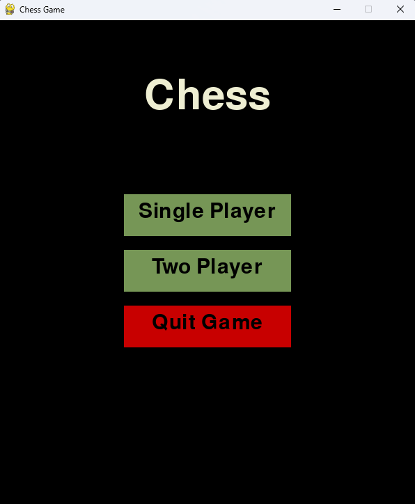
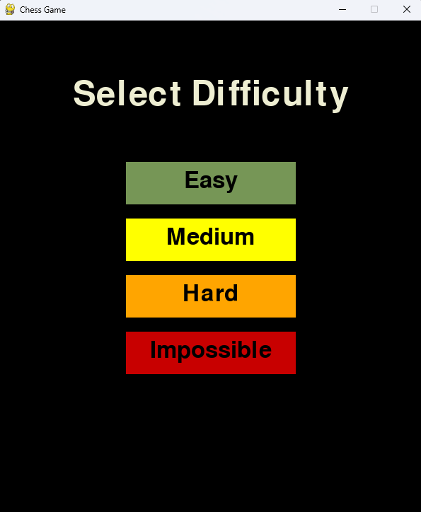
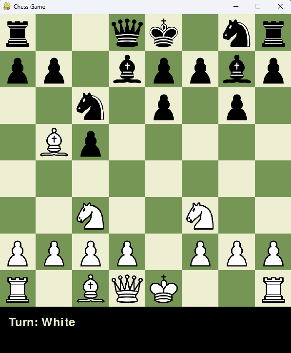
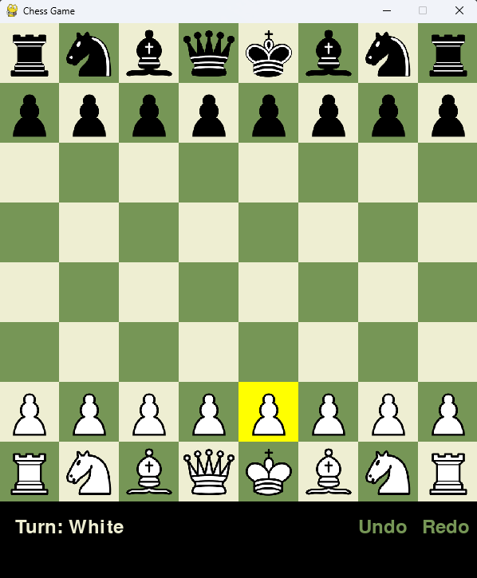
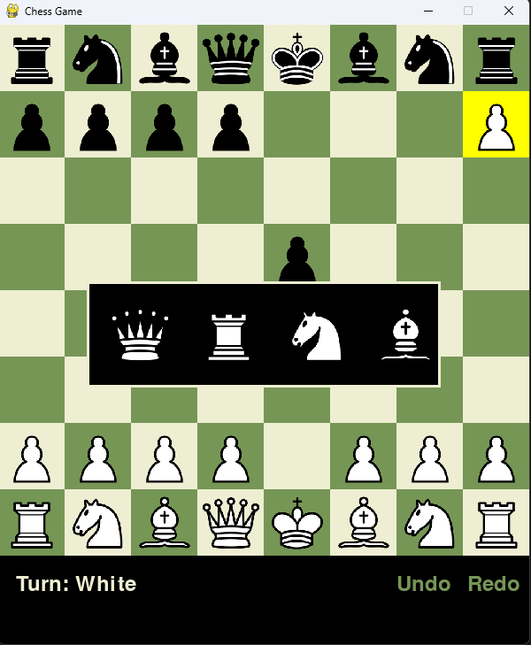
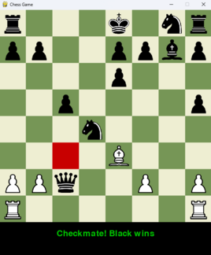

# PyChess
♟️ Python chess game with Stockfish AI and Pygame GUI – play vs computer or friends locally!

---

# Chess Game with Pygame and Stockfish


A feature-rich chess implementation built with Python's Pygame library, powered by the Stockfish chess engine for AI gameplay. This project offers both single-player against computer and local two-player modes with intuitive graphical interface.

## Key Features

### Game Modes
- **Single Player**: Challenge the Stockfish AI at various difficulty levels  
  
  
- **Two Player**: Play locally against a friend with undo/redo functionality  
  

### Gameplay Features
- Complete chess rules implementation including:
  - En passant
  - Castling
  - Pawn promotion with graphical selection menu  
    
  - Check/checkmate detection
- Visual indicators:
  - Yellow highlight for selected pieces
  - Red highlight for king in checkmate  
    
- Turn indicator and game status display

## Installation

1. **Prerequisites**:
   ```bash
   pip install pygame python-chess
   ```

2. **Stockfish Setup**:
   - Download Stockfish from [official site](https://stockfishchess.org/download/)
   - Update engine path in code (line ~45):
     ```python
     engine_path = r"YOUR_PATH_TO\stockfish-windows-x86-64-avx2.exe"
     ```

3. **Run the game**:
   ```bash
   python PyChess.py
   ```

## How to Play

- **Piece Movement**: Click on a piece, then click on destination square
- **Special Moves**:
  - Castling: Move king two squares toward rook
  - Promotion: Automatic menu appears when pawn reaches back rank
- **Game Controls**:
  - Undo/Redo available in two-player mode (bottom-right buttons)  
  - After game ends, click to return to main menu

## Technical Details

- **Engine**: Uses Stockfish via python-chess UCI interface
- **AI Configuration**: Skill levels map to Stockfish's difficulty settings (0-20 scale)
- **Graphics**: All standard chess pieces with clean green/white board

## License
- **This project**: [MIT License](LICENSE) - Free for any use  
- **Stockfish engine**: [GPL-3.0 License](https://stockfishchess.org/get-involved/) (required for AI)  
